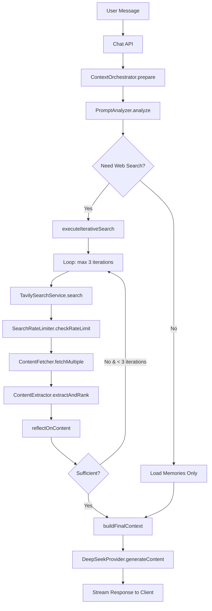

# Web Search Feature - Design Document
# 网络搜索功能 - 设计文档

**Version:** 2.0 (Python + Tavily + DeepSeek)  
**Last Updated:** 2025-12-20  
**Status:** Under Development  
**Technology Stack:** 
- Backend: Python 3.13 + FastAPI
- Async Runtime: asyncio
- Search API: Tavily Search
- AI Models: DeepSeek Chat & DeepSeek Reasoner
- Integration: `/api/chat` endpoint with SSE

**Related:** [WEB_SEARCH_SPEC.md](./WEB_SEARCH_SPEC.md) | [WEB_SEARCH_TASKS.md](./WEB_SEARCH_TASKS.md)

---

## Table of Contents | 目录

1. [Architecture Overview | 架构概览](#1-architecture-overview)
2. [System Components | 系统组件](#2-system-components)
3. [Data Flow | 数据流](#3-data-flow)
4. [API Design | API 设计](#4-api-design)
5. [Database Schema | 数据库模式](#5-database-schema)
6. [Algorithm Details | 算法详情](#6-algorithm-details)
7. [Performance Optimization | 性能优化](#7-performance-optimization)
8. [Error Handling | 错误处理](#8-error-handling)
9. [Security Considerations | 安全考虑](#9-security-considerations)

---

## 1. Architecture Overview | 架构概览

### 1.1 High-Level Architecture | 高层架构

```
┌─────────────────────────────────────────────────────────────────┐
│                      Chat Application                           │
│                    /app/api/chat/route.py                       │
└────────────────────────────┬────────────────────────────────────┘
                             │
                             ▼
┌─────────────────────────────────────────────────────────────────┐
│                      Chat API Handler                           │
│              backend/src/agent/app.py                           │
└────────────────────────────┬────────────────────────────────────┘
                             │
                             ▼
┌─────────────────────────────────────────────────────────────────┐
│                    Context Orchestrator                         │
│              backend/src/agent/orchestrator.py                  │
│                                                                 │
│  ┌──────────────────────────────────────────────────────────┐  │
│  │  1. Prompt Analysis (PromptAnalyzer)                     │  │
│  │     - Analyze user input with DeepSeek                   │  │
│  │     - Determine web search necessity                     │  │
│  │     - Generate initial search query                      │  │
│  └──────────────────────────────────────────────────────────┘  │
│                             │                                   │
│                             ▼                                   │
│  ┌──────────────────────────────────────────────────────────┐  │
│  │  2. Iterative Search Loop (max 3 iterations)            │  │
│  │     ┌────────────────────────────────────────────┐      │  │
│  │     │ 2.1 Execute Web Search                     │      │  │
│  │     │     - Tavily Search API                    │      │  │
│  │     │     - Rate limit check                     │      │  │
│  │     │     - Get 5-10 results                     │      │  │
│  │     └────────────────────────────────────────────┘      │  │
│  │                       │                                  │  │
│  │                       ▼                                  │  │
│  │     ┌────────────────────────────────────────────┐      │  │
│  │     │ 2.2 Fetch Content (top 3 URLs)            │      │  │
│  │     │     - 4-tier fallback chain               │      │  │
│  │     │     - Concurrent fetch (2 at a time)      │      │  │
│  │     └────────────────────────────────────────────┘      │  │
│  │                       │                                  │  │
│  │                       ▼                                  │  │
│  │     ┌────────────────────────────────────────────┐      │  │
│  │     │ 2.3 Extract & Rank Content                │      │  │
│  │     │     - DeepSeek API extraction             │      │  │
│  │     │     - Sort by relevanceScore              │      │  │
│  │     └────────────────────────────────────────────┘      │  │
│  │                       │                                  │  │
│  │                       ▼                                  │  │
│  │     ┌────────────────────────────────────────────┐      │  │
│  │     │ 2.4 Reflect on Sufficiency                │      │  │
│  │     │     - AI judges if info is sufficient     │      │  │
│  │     │     - Generate refined query if needed    │      │  │
│  │     └────────────────────────────────────────────┘      │  │
│  │                       │                                  │  │
│  │                       ▼                                  │  │
│  │           [sufficient? OR max iterations?]               │  │
│  │                  │           │                           │  │
│  │                NO│          YES                          │  │
│  │            (loop back)    (exit)                         │  │
│  └──────────────────────────────────────────────────────────┘  │
│                             │                                   │
│                             ▼                                   │
│  ┌──────────────────────────────────────────────────────────┐  │
│  │  3. Build Final Context                                 │  │
│  │     - Combine memories + search results                 │  │
│  │     - Format as Markdown                                │  │
│  └──────────────────────────────────────────────────────────┘  │
└────────────────────────────┬────────────────────────────────────┘
                             │
                             ▼
┌─────────────────────────────────────────────────────────────────┐
│                   DeepSeek Provider (Main)                      │
│               Generate final AI response with                   │
│                DeepSeek Chat/Reasoning API                      │
└─────────────────────────────────────────────────────────────────┘
```

### 1.2 Component Interaction | 组件交互



---

## 2. System Components | 系统组件

### 2.1 Component Directory Structure | 组件目录结构

```
src/
├── lib/
│   ├── prompt-analysis/
│   │   └── analyzer.ts              # 提示词分析器
│   ├── context-engineering/
│   │   └── orchestrator.ts          # 上下文编排器（核心）
│   ├── web-search/
│   │   ├── google-search.ts         # Google 搜索服务
│   │   ├── rate-limiter.ts          # 速率限制器
│   │   ├── content-fetcher.ts       # 内容获取器
│   │   └── content-extractor.ts     # 内容提取器
│   ├── memory/
│   │   ├── loader.ts                # 记忆加载器
│   │   └── storage.ts               # 记忆存储
│   └── progress/
│       ├── emitter.ts               # 进度发射器
│       └── types.ts                 # 进度类型定义
└── types/
    ├── prompt-analysis.ts           # 提示词分析类型
    ├── web-search.ts                # 网络搜索类型
    └── memory.ts                    # 记忆类型
```

### 2.2 Core Components | 核心组件

### 关键决策：
- **DeepSeek 模型分配:**
  - `deepseek-chat`: PromptAnalyzer、ContentExtractor（速度优先）
  - `deepseek-reasoner`: SearchReflection（推理判断，判断搜索是否充分）
- **API 集成方式:** 无独立网络搜索端点，完全集成在 `/api/chat` 中
- **错误处理:** 所有外部 API 调用支持最多 3 次重试
- **存储方案:** 暂时使用内存存储，无频率限制

#### 2.2.1 PromptAnalyzer
**文件:** `backend/src/agent/prompt_analyzer.py`

**职责:**
- 分析用户输入的意图
- 判断是否需要网络搜索
- 生成初始搜索查询和目标信息

**关键方法:**
```python
class PromptAnalyzer:
    async def analyze(self, input: PromptAnalysisInput) -> PromptAnalysisResult:
        """Analyze user input to determine if web search is needed"""
        pass
```

**输入:**
```python
@dataclass
class PromptAnalysisInput:
    user_message: str
    conversation_history: Optional[list] = None
    current_date: Optional[str] = None
```

**输出:**
```python
@dataclass
class PromptAnalysisResult:
    actions: dict
```

**实现技术:**
- 模型: DeepSeek Chat (`deepseek-chat`)
- 温度: 0.3（保证一致性）
- 结构化输出: JSON format

#### 2.2.2 ContextOrchestrator
**文件:** `backend/src/agent/orchestrator.py`

**职责:**
- 协调整个上下文准备流程
- 管理迭代搜索逻辑
- 整合记忆和搜索结果

**关键方法:**
```python
class ContextOrchestrator:
    async def prepare(self, params: ContextPreparationParams) -> ContextEngineeringResult
    private async def execute_iterative_search(self) -> dict
    private async def execute_web_search(self) -> list[SearchResult]
    private async def fetch_and_extract_content(self) -> list[ExtractedContent]
    private async def reflect_on_content(self) -> SearchReflection
    private def build_final_context(self) -> str
```

**状态管理:**
- 累积所有迭代的搜索结果
- 跟踪进度并通过 SSE 发送
- 处理错误和降级

#### 2.2.3 TavilySearchService
**文件:** `backend/src/agent/web_search.py`

**职责:**
- 封装 Tavily Search API
- 处理 API 错误和重试
- 返回搜索结果

**关键方法:**
```python
class TavilySearchService:
    def __init__(self, api_key: str, max_retries: int = 3):
        self.api_key = api_key
        self.max_retries = max_retries
    
    async def search(self, query: str, num_results: int = 5) -> list[SearchResult]:
        """使用 Tavily 搜索，支持重试机制"""
        pass
```

**配置:**
```python
API_ENDPOINT = "https://api.tavily.com/search"
config = {
    "api_key": os.getenv("TAVILY_API_KEY"),
    "num_results": num_results,  # 5-10 个结果
    "include_answer": True,
    "include_raw_content": True,  # 获取网页原始内容
    "max_retries": 3  # 失败重试 3 次
}
```

**错误处理:**
- 失败重试最多 3 次
- 3 次都失败后抛出异常
- 前端收到错误信息并提示用户

#### 2.2.4 SearchRateLimiter
**文件:** `backend/src/agent/rate_limiter.py`

**职责:**
- 管理搜索频率（暂不限制）
- 追踪 API 调用
- 内存记录

**关键方法:**
```python
class SearchRateLimiter:
    async def check_rate_limit(self) -> dict:
        """检查是否允许搜索（暂不限制）"""
        return {"allowed": True, "remaining": -1}
    
    async def track_usage(self, user_id: str, query: str) -> None:
        """追踪搜索使用"""
        pass
```

**说明:**
- 当前阶段暂不实施频率限制
- 使用最简单的存储（可选）
- 后续可扩展为 Redis 或数据库

#### 2.2.5 ContentFetcher
**文件:** `backend/src/agent/content_fetcher.py`

**职责:**
- 获取网页内容
- 4 层回退链
- 并发控制

**关键方法:**
```python
class ContentFetcher:
    async def fetch(self, url: str) -> str:
        """Try 4 layers to fetch content"""
        pass
    
    async def fetch_multiple(self, urls: list[str], concurrency: int = 2) -> dict:
        """Fetch multiple URLs with concurrency control"""
        pass
```

**回退链实现:**
```python
async def fetch(self, url: str) -> str:
    # Layer 1: Cache
    if url in self.cache:
        return self.cache[url]
    
    # Layer 2: Direct fetch with User-Agent rotation
    try:
        content = await self.direct_fetch(url)
        self.cache[url] = content
        return content
    except:
        pass
    
    # Layer 3: Jina.ai Reader
    try:
        return await self.jina_fetch(url)
    except:
        pass
    
    # Layer 4: Archive.org
    return await self.archive_fetch(url)
```

#### 2.2.6 ContentExtractor
**文件:** `backend/src/agent/content_extractor.py`

**职责:**
- 使用 DeepSeek Chat 提取相关内容
- 评估相关性
- 排序结果

**关键方法:**
```python
class ContentExtractor:
    async def extract(self, 
                     raw_content: str,
                     user_question: str,
                     target_info: list[str],
                     source_url: str) -> ExtractedContent:
        """从网页内容中提取相关信息"""
        pass
    
    async def extract_and_rank(self, 
                              items: list[dict],
                              user_question: str,
                              target_info: list[str]) -> list[ExtractedContent]:
        """并行提取和排序多个内容"""
        pass
```

**提取提示词模板:**
```python
prompt = f"""
You are an expert at extracting relevant information from web content.

**User Question:** {user_question}
**Looking For:** {', '.join(target_info)}

**Web Content:**
{raw_content}

Extract the most relevant information and output JSON:
{{
  "title": "...",
  "summary": "...",
  "keyPoints": ["...", "..."],
  "relevanceScore": 8.5,
  "confidence": 0.9
}}
"""
```

**实现技术:**
- 模型: DeepSeek Chat (`deepseek-chat`)
- 温度: 0.5（平衡创意和准确性）
- 并发: 最多 2-3 个内容同时提取

#### 2.2.7 SearchReflection
**文件:** `backend/src/agent/orchestrator.py` (method: `reflect_on_content`)

**职责:**
- 使用 DeepSeek Reasoner 判断信息是否充分
- 决定是否需要继续搜索
- 生成优化的搜索查询

**关键方法:**
```python
async def reflect_on_content(self,
                            extracted_content: list[ExtractedContent],
                            target_info: list[str],
                            user_question: str,
                            iteration: int) -> SearchReflection:
    """使用 DeepSeek Reasoner 反思内容充分性"""
    pass
```

**输出:**
```python
@dataclass
class SearchReflection:
    sufficient: bool  # 是否足够充分
    missing_aspects: list[str]  # 缺失的方面
    refined_query: str  # 优化后的查询
    reasoning: str  # 推理过程说明
    confidence: float  # 置信度 0.0-1.0
```

**实现技术:**
- 模型: DeepSeek Reasoner (`deepseek-reasoner`)
- 温度: 0.3（逻辑推理）
- 用途：判断是否继续搜索（重要决策）
**文件:** `src/lib/progress/emitter.ts`

**职责:**
- 实时推送进度到客户端
- SSE 流管理

**关键方法:**
```typescript
class ProgressEmitter {
  emit(event: ProgressEvent): void
  emitWebSearchStart(query: string): void
  emitWebSearchIteration(iteration: number, query: string): void
  emitWebSearchComplete(resultsCount: number): void
}
```

**事件格式:**
```typescript
interface ProgressEvent {
  type: "web_search_start" | "web_search_iteration" | ...;
  data: {
    iteration?: number;
    query?: string;
    message: string;
  };
}
```

---

## 3. Data Flow | 数据流

### 3.1 Complete Request Flow | 完整请求流

```
1. User sends message
   ↓
2. Chat API receives request
   └→ POST /api/chat
      Body: { message: "今天特斯拉股价多少？", conversationId: "..." }
   ↓
3. Create SSE stream
   ↓
4. ContextOrchestrator.prepare() called
   ├─ Load conversation history
   ├─ PromptAnalyzer.analyze()
   │  └→ Gemini Flash Lite call
   │     Input: user message + history
   │     Output: PromptAnalysisResult { web_search: { needed: true, query: "Tesla stock price today", ... } }
   ├─ Load memories (if any)
   └─ executeIterativeSearch() [if needed]
      │
      ├─ ITERATION 1
      │  ├─ emit("web_search_iteration", { iteration: 1, query: "Tesla stock price today" })
      │  ├─ GoogleSearchService.search("Tesla stock price today", 5)
      │  │  └→ GET https://www.googleapis.com/customsearch/v1?q=Tesla+stock+price+today&num=5
      │  │     Response: [{ title: "...", link: "...", snippet: "..." }, ...]
      │  ├─ SearchRateLimiter.checkRateLimit()
      │  ├─ SearchRateLimiter.trackUsage()
      │  ├─ emit("web_search_fetching", { count: 3 })
      │  ├─ ContentFetcher.fetchMultiple([url1, url2, url3], { concurrency: 2 })
      │  │  └→ Parallel fetches with 4-tier fallback
      │  ├─ emit("web_search_extracting")
      │  ├─ ContentExtractor.extractAndRank(...)
      │  │  └→ 3x Gemini Flash Lite calls (parallel)
      │  │     Input: rawContent + userQuestion + targetInfo
      │  │     Output: [{ title, summary, keyPoints, relevanceScore, confidence }, ...]
      │  ├─ emit("web_search_reflecting")
      │  └─ reflectOnContent(extractedContent, targetInfo, userQuestion)
      │     └→ Gemini Flash Lite call
      │        Input: extracted content + target info
      │        Output: { sufficient: false, missingAspects: ["历史价格对比"], refinedQuery: "Tesla stock price trend 2024" }
      │
      ├─ ITERATION 2 (if not sufficient)
      │  ├─ Use refinedQuery: "Tesla stock price trend 2024"
      │  └─ ... (repeat above steps)
      │
      └─ ITERATION 3 (if still not sufficient)
         └─ ... (final iteration, accept result regardless)
   ↓
5. buildFinalContext()
   └→ Combine memories + all extracted content → Markdown string
   ↓
6. emit("web_search_complete", { resultsCount: 7 })
   ↓
7. GeminiProvider.generateContent()
   └→ Stream response with enriched context
   ↓
8. Client receives SSE events
   └→ Display progress + final answer
```

### 3.2 Data Transformation Pipeline | 数据转换管道

```
Raw User Input
    ↓ [PromptAnalyzer]
PromptAnalysisResult { actions: { web_search: {...} } }
    ↓ [GoogleSearchService]
SearchResult[] [{ title, link, snippet }]
    ↓ [ContentFetcher]
Map<url, rawContent> { "https://...": "long HTML text..." }
    ↓ [ContentExtractor]
ExtractedContent[] [{ title, summary, keyPoints, relevanceScore }]
    ↓ [Sort by relevanceScore]
Ranked ExtractedContent[]
    ↓ [reflectOnContent]
SearchReflection { sufficient, missingAspects, refinedQuery }
    ↓ [buildFinalContext]
Markdown Context String
    ↓ [GeminiProvider]
AI Response (streamed)
```

---

## 4. API Design | API 设计

### 4.1 Internal APIs | 内部 API

#### 4.1.1 PromptAnalyzer.analyze()
```typescript
// Request
interface PromptAnalysisInput {
  userMessage: string;
  conversationHistory?: ConversationMessage[];
  currentDate?: string;
}

// Response
interface PromptAnalysisResult {
  actions: {
    web_search: {
      needed: boolean;
      query: string;
      userQuestion: string;
      targetInfo: string[];
      reason: string;
      priority: number;
    };
    image_generation: { needed: boolean; };
    needs_deep_research: boolean;
  };
}
```

#### 4.1.2 GoogleSearchService.search()
```typescript
// Request
search(query: string, numResults: number = 5): Promise<SearchResult[]>

// Response
interface SearchResult {
  title: string;
  link: string;
  snippet: string;
  displayLink: string;
}
```

#### 4.1.3 ContentFetcher.fetch()
```typescript
// Request
fetch(url: string): Promise<string>

// Response
string (plain text content, max 10,000 chars)

// Error
throws Error if all 4 layers fail
```

#### 4.1.4 ContentExtractor.extract()
```typescript
// Request
interface ExtractParams {
  rawContent: string;
  userQuestion: string;
  targetInfo: string[];
  sourceUrl: string;
}

// Response
interface ExtractedContent {
  sourceUrl: string;
  title: string;
  summary: string;
  keyPoints: string[];
  relevanceScore: number;
  confidence: number;
  extractedAt: Date;
}
```

#### 4.1.5 reflectOnContent()
```typescript
// Request
interface ReflectParams {
  extractedContent: ExtractedContent[];
  targetInfo: string[];
  userQuestion: string;
  iteration: number;
}

// Response
interface SearchReflection {
  sufficient: boolean;
  missingAspects?: string[];
  refinedQuery?: string;
  reasoning: string;
  confidence: number;
}
```

### 4.2 External APIs | 外部 API

#### 4.2.1 Google Custom Search API
```http
GET https://www.googleapis.com/customsearch/v1
?key={API_KEY}
&cx={SEARCH_ENGINE_ID}
&q={QUERY}
&num={NUM_RESULTS}

Response:
{
  "items": [
    {
      "title": "...",
      "link": "...",
      "snippet": "...",
      "displayLink": "..."
    }
  ]
}
```

**配置:**
- API Key: `GOOGLE_API_KEY` (env var)
- Search Engine ID: `GOOGLE_SEARCH_ENGINE_ID` (env var)

#### 4.2.2 Jina.ai Reader API
```http
GET https://r.jina.ai/{URL}

Response: Plain text content
```

#### 4.2.3 Archive.org API
```http
GET https://archive.org/wayback/available?url={URL}

Response:
{
  "archived_snapshots": {
    "closest": {
      "url": "https://web.archive.org/web/..."
    }
  }
}
```

---

## 5. Database Schema | 数据库模式

### 5.1 Firestore Collections | Firestore 集合

#### 5.1.1 `search_usage` Collection
存储每日搜索使用情况。

```typescript
// Document ID: YYYY-MM-DD (e.g., "2024-12-19")
interface SearchUsageDocument {
  date: string;
  count: number;
  searches: SearchRecord[];
  totalCost: number;
  createdAt: Timestamp;
  updatedAt: Timestamp;
}

interface SearchRecord {
  userId: string;
  query: string;
  timestamp: Timestamp;
  estimatedCost: number;
  resultsCount: number;
}
```

**索引:**
- `date` (ascending)
- `searches.userId` (for user-level analytics)

#### 5.1.2 `conversations` Collection
（现有集合，添加搜索元数据）

```typescript
interface ConversationMessage {
  role: "user" | "assistant";
  content: string;
  timestamp: Timestamp;
  metadata?: {
    webSearchPerformed?: boolean;
    searchIterations?: number;
    searchResultsCount?: number;
  };
}
```

---

## 6. Algorithm Details | 算法详情

### 6.1 Iterative Search Algorithm | 迭代搜索算法

```typescript
async executeIterativeSearch(
  userId: string,
  analysis: PromptAnalysisResult,
  progressEmitter?: ProgressEmitter
): Promise<{
  searchResults: SearchResult[];
  extractedContent: ExtractedContent[];
  rateLimitError?: string;
}> {
  const MAX_ITERATIONS = 3;
  const allSearchResults: SearchResult[] = [];
  const allExtractedContent: ExtractedContent[] = [];
  
  let currentQuery = analysis.actions.web_search.query;
  const targetInfo = analysis.actions.web_search.targetInfo;
  const userQuestion = analysis.actions.web_search.userQuestion;
  
  for (let iteration = 0; iteration < MAX_ITERATIONS; iteration++) {
    progressEmitter?.emitWebSearchIteration(iteration + 1, currentQuery);
    
    // Step 1: Execute search
    const searchResults = await this.executeWebSearch(
      currentQuery,
      userId,
      progressEmitter
    );
    
    if (searchResults.length === 0) break;
    allSearchResults.push(...searchResults);
    
    // Step 2: Fetch & extract content
    const extractedContent = await this.fetchAndExtractContent(
      searchResults,
      userQuestion,
      targetInfo,
      progressEmitter
    );
    
    if (extractedContent.length === 0) break;
    allExtractedContent.push(...extractedContent);
    
    // Step 3: Reflect on sufficiency
    progressEmitter?.emit({
      type: "web_search_reflecting",
      data: { message: "AI is reflecting on the gathered information..." }
    });
    
    const reflection = await this.reflectOnContent(
      allExtractedContent,
      targetInfo,
      userQuestion,
      iteration
    );
    
    // Step 4: Decide whether to continue
    if (reflection.sufficient || iteration === MAX_ITERATIONS - 1) {
      break; // Exit loop
    }
    
    // Step 5: Refine query for next iteration
    if (reflection.refinedQuery) {
      currentQuery = reflection.refinedQuery;
    } else {
      break; // No refined query, stop
    }
  }
  
  return {
    searchResults: allSearchResults,
    extractedContent: allExtractedContent
  };
}
```

### 6.2 Content Ranking Algorithm | 内容排序算法

```typescript
async extractAndRank(
  items: Array<{ url: string; rawContent: string }>,
  userQuestion: string,
  targetInfo: string[]
): Promise<ExtractedContent[]> {
  // Parallel extraction
  const extractionPromises = items.map(item =>
    this.extract({
      rawContent: item.rawContent,
      userQuestion,
      targetInfo,
      sourceUrl: item.url
    })
  );
  
  const results = await Promise.all(extractionPromises);
  
  // Sort by relevanceScore (descending)
  return results.sort((a, b) => b.relevanceScore - a.relevanceScore);
}
```

### 6.3 Reflection Decision Algorithm | 反思决策算法

```typescript
async reflectOnContent(
  extractedContent: ExtractedContent[],
  targetInfo: string[],
  userQuestion: string,
  iteration: number
): Promise<SearchReflection> {
  const prompt = `
You are evaluating whether the gathered information is sufficient to answer the user's question.

**User Question:** ${userQuestion}
**Target Information:** ${targetInfo.join(", ")}
**Current Iteration:** ${iteration + 1}/3

**Gathered Content:**
${extractedContent.map(c => `
- ${c.title} (relevance: ${c.relevanceScore})
  Summary: ${c.summary}
  Key Points: ${c.keyPoints.join(", ")}
`).join("\n")}

**Task:** Evaluate if this information is sufficient. Output JSON:
{
  "sufficient": true/false,
  "missingAspects": ["aspect1", "aspect2"],
  "refinedQuery": "new search query",
  "reasoning": "explanation",
  "confidence": 0.0-1.0
}

**Rules:**
- If sufficient, set "sufficient": true
- If missing critical info, set "sufficient": false and provide "refinedQuery"
- Be concise in "missingAspects" (max 3)
`;

  const response = await gemini.generateContent({
    model: "gemini-2.5-flash-lite",
    prompt,
    temperature: 0.4
  });
  
  return JSON.parse(response);
}
```

---

## 7. Performance Optimization | 性能优化

### 7.1 Caching Strategy | 缓存策略

#### 7.1.1 Content Cache
```typescript
class ContentCache {
  private cache = new Map<string, { content: string; timestamp: number }>();
  private TTL = 60 * 60 * 1000; // 1 hour
  
  get(url: string): string | null {
    const entry = this.cache.get(url);
    if (!entry) return null;
    
    if (Date.now() - entry.timestamp > this.TTL) {
      this.cache.delete(url);
      return null;
    }
    
    return entry.content;
  }
  
  set(url: string, content: string): void {
    this.cache.set(url, { content, timestamp: Date.now() });
  }
}
```

#### 7.1.2 Analysis Cache
缓存相同用户消息的分析结果（同一会话内）。

### 7.2 Concurrent Processing | 并发处理

#### 7.2.1 Content Fetching
```typescript
async fetchMultiple(
  urls: string[],
  options: { concurrency?: number } = {}
): Promise<Map<string, string>> {
  const concurrency = options.concurrency || 2;
  const results = new Map<string, string>();
  
  // Process in batches
  for (let i = 0; i < urls.length; i += concurrency) {
    const batch = urls.slice(i, i + concurrency);
    const promises = batch.map(url => this.fetch(url));
    const batchResults = await Promise.allSettled(promises);
    
    batchResults.forEach((result, index) => {
      if (result.status === 'fulfilled') {
        results.set(batch[index], result.value);
      }
    });
  }
  
  return results;
}
```

#### 7.2.2 Content Extraction
所有提取任务并行执行（3 个页面同时）。

### 7.3 Response Streaming | 响应流式传输

```typescript
// SSE stream for progress
const stream = new ReadableStream({
  start(controller) {
    progressEmitter.on('event', (event) => {
      const data = `data: ${JSON.stringify(event)}\n\n`;
      controller.enqueue(encoder.encode(data));
    });
  }
});
```

### 7.4 Timeout Management | 超时管理

```typescript
const TIMEOUTS = {
  search: 3000,        // Google Search API
  fetch: 8000,         // Single URL fetch
  extraction: 10000,   // AI extraction
  reflection: 5000     // AI reflection
};

async function withTimeout<T>(promise: Promise<T>, ms: number): Promise<T> {
  const timeout = new Promise((_, reject) =>
    setTimeout(() => reject(new Error('Timeout')), ms)
  );
  return Promise.race([promise, timeout]);
}
```

---

## 8. Error Handling | 错误处理

### 8.1 Error Types | 错误类型

```typescript
class WebSearchError extends Error {
  constructor(
    message: string,
    public code: string,
    public recoverable: boolean
  ) {
    super(message);
  }
}

// Error codes
const ERROR_CODES = {
  RATE_LIMIT_EXCEEDED: "RATE_LIMIT_EXCEEDED",
  API_KEY_INVALID: "API_KEY_INVALID",
  SEARCH_FAILED: "SEARCH_FAILED",
  FETCH_FAILED: "FETCH_FAILED",
  EXTRACTION_FAILED: "EXTRACTION_FAILED",
  ALL_SOURCES_FAILED: "ALL_SOURCES_FAILED"
};
```

### 8.2 Error Handling Strategy | 错误处理策略

```typescript
async executeIterativeSearch(): Promise<{...}> {
  try {
    // ... search logic
  } catch (error) {
    if (error.code === 'RATE_LIMIT_EXCEEDED') {
      return {
        searchResults: [],
        extractedContent: [],
        rateLimitError: "已达到每日搜索限制（100次）"
      };
    }
    
    if (error.code === 'SEARCH_FAILED' && error.recoverable) {
      console.warn("Search failed, continuing without web search");
      return { searchResults: [], extractedContent: [] };
    }
    
    throw error; // Non-recoverable errors
  }
}
```

### 8.3 Fallback Mechanisms | 降级机制

1. **Search failure** → Continue with memories only
2. **Content fetch failure** → Try next URL
3. **All fetches failed** → Use search snippets only
4. **Extraction failure** → Return raw snippet
5. **Reflection failure** → Assume sufficient (stop iteration)

---

## 9. Security Considerations | 安全考虑

### 9.1 API Key Protection | API 密钥保护

```typescript
// ❌ NEVER expose in client code
// ✅ Store in environment variables
const GOOGLE_API_KEY = process.env.GOOGLE_API_KEY;
const GOOGLE_SEARCH_ENGINE_ID = process.env.GOOGLE_SEARCH_ENGINE_ID;

// Validate on startup
if (!GOOGLE_API_KEY || !GOOGLE_SEARCH_ENGINE_ID) {
  throw new Error("Missing required environment variables");
}
```

### 9.2 Input Sanitization | 输入清理

```typescript
function sanitizeSearchQuery(query: string): string {
  return query
    .trim()
    .replace(/[<>]/g, '') // Remove HTML tags
    .substring(0, 200);   // Limit length
}
```

### 9.3 URL Validation | URL 验证

```typescript
function isValidUrl(url: string): boolean {
  try {
    const parsed = new URL(url);
    return parsed.protocol === 'http:' || parsed.protocol === 'https:';
  } catch {
    return false;
  }
}
```

### 9.4 Rate Limiting | 速率限制

全局和用户级别的双重限制（防止滥用）。

---

## 10. Testing Strategy | 测试策略

### 10.1 Unit Tests | 单元测试

```typescript
describe('PromptAnalyzer', () => {
  it('should detect web search need for latest info', async () => {
    const result = await PromptAnalyzer.analyze({
      userMessage: "What is the latest news about Tesla?"
    });
    expect(result.actions.web_search.needed).toBe(true);
  });
  
  it('should NOT trigger search for general knowledge', async () => {
    const result = await PromptAnalyzer.analyze({
      userMessage: "Explain binary search algorithm"
    });
    expect(result.actions.web_search.needed).toBe(false);
  });
});
```

### 10.2 Integration Tests | 集成测试

```typescript
describe('Web Search Flow', () => {
  it('should complete full search flow', async () => {
    const result = await orchestrator.prepare({
      userMessage: "Tesla stock price today",
      userId: "test-user"
    });
    
    expect(result.context).toContain("Web Search Results");
    expect(result.webSearchResults.length).toBeGreaterThan(0);
  });
});
```

### 10.3 E2E Tests | 端到端测试

使用 Playwright 测试完整的用户流程。

---

## 11. Monitoring & Logging | 监控与日志

### 11.1 Metrics | 指标

```typescript
interface WebSearchMetrics {
  searchCount: number;
  averageIterations: number;
  averageResponseTime: number;
  successRate: number;
  errorRate: number;
  cacheHitRate: number;
}
```

### 11.2 Logging | 日志

```typescript
console.log('[WebSearch] Starting search', { query, userId });
console.log('[WebSearch] Iteration', { iteration, resultsCount });
console.log('[WebSearch] Reflection', { sufficient, confidence });
console.error('[WebSearch] Error', { error, query, userId });
```

---

## 12. Deployment Considerations | 部署考虑

### 12.1 Environment Variables | 环境变量

```bash
GOOGLE_API_KEY=your_api_key
GOOGLE_SEARCH_ENGINE_ID=your_cx_id
GEMINI_API_KEY=your_gemini_key
```

### 12.2 Dependencies | 依赖

```json
{
  "dependencies": {
    "@google/generative-ai": "^0.x.x",
    "cheerio": "^1.0.0",
    "marked": "^x.x.x"
  }
}
```

---

**End of Design Document**
